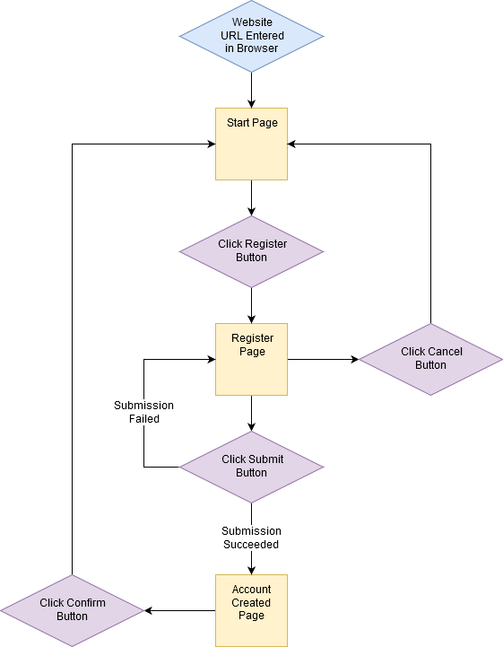
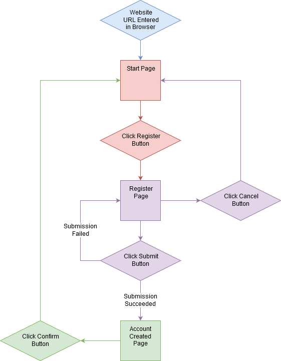

# State Machine
This repo is dedicated to a simple implmentation of a finite state machine (FSM) data structure.

## What is a State Machine?
According to [Wikipedia](https://en.wikipedia.org/wiki/Finite-state_machine):
> A state machine is a mathematical model of computation. It is an abstract machine that can be in exactly one of a finite number of **states** at any given time. The FSM can change from one state to another in response to some external inputs; the change from one state to another is called a **transition**. An FSM is defined by a list of its states, its initial state, and the conditions for each transition.

> Simple examples are **vending machines**, which dispense products when the proper combination of coins is deposited, **elevators**, whose sequence of stops is determined by the floors requested by riders, **traffic lights**, which change sequence when cars are waiting, and **combination locks**, which require the input of a sequence of numbers in the proper order.

### I like to think of state machines as employable _flowcharts_.
And that's how I had been using them to conduct my early homeworks in the Full-Stack Coding Camp.

## Goals of this Project
I have a few goals with this project:

1. Create a re-usable state machine data structure employable in anyone's JavaScript projects.
2. Demonstrate how it works and a couple ways it can be used to separate code concerns.
3. Further my own, and hopefully someone else's, understanding of JavaScript and data structures.

## How does it work?
Okay. Remember when I equated state machines to _flowcharts_? If you're not familiar with what a flowchart is, it's basically a visualization of how a process works through the use of shapes and arrows. They can easily be used to visualize and plan out how a User Interface will work—which is pretty much what the front-end of a website is. That said, let's explore the user flow of a website registration process.

Imagine the **diamonds** as _actions_ taken by the user and **squares** as _pages_ the user sees. The **arrows** denote the direction in which the user is flowing through the chart. We'll start following the user's flow at the point at which they enter our website's URL into their browser.



As you follow along the user flow, notice how:

- The user is only ever on one _page_ at a time.
- The user can only _transition_ to another _page_ by taking an _action_.

We can take advantage of this user flow structure to create a single-page website as my team did with our [Send Care MEOW](https://jandystephens.github.io/Send-Care-MEOW/) web app.

First, let's group the _pages_ and _actions_ together into separate chunks, and we'll consider each chunk as a self-contained _state_.



As you can see, we now have **three separate states**. It's important to note the states (as we've divided them) do _not_ need to know any information about the other states to operate. They're fully functioning on their own. The only information they need to know is where the _transitioning_ buttons lead (demonstrated by the muddy orange arrows).

Okay, you may be thinking it's nothing special so far, but stick with me. We're about to dive into the main feature of this state machine data structure.

## Why are states so great?
The main benefits of states are:

- They don't need to know any information about the other states to function.
- Only one state is active at a time.
- They take care of themselves and only themselves.

These points are important for separating code concerns which will save time and headaches in the future for you and your teammates. It also has the added benefit of reducing the amount of merge conflicts you have to resolve when using a version control like Git, moreso if you separate the states into different files.

For more information about separation of code concerns, check out these extremely-well-designed and free video explanations from Coursera on [Loose Coupling & High Cohesion \[6m 36s\]](https://www.coursera.org/lecture/object-oriented-design/1-3-1-coupling-and-cohesion-q8wGt) and [Separation of Concerns \[9m 05s\]](https://www.coursera.org/lecture/object-oriented-design/1-3-2-separation-of-concerns-nBqPZ). (When they talk about "Classes", imagine them as like the Constructor Functions we learned about.) I highly recommend these videos. This is something I was required to learn when I took Computer Science in college, but it wasn't explained as well as these 16 minutes explained it.

Okay, done watching them? No? **Go watch them!** It really is enlightening!

Okay, now done watching them? ...Great!

So! Now you have an inkling of the benefits we get from states, but how do we actually extract those benefits?

That comes from how we set up the **States** and the **State Machine**.

## How it all works, finally!
Let's continue our train of thought with _states_ and then move into _state machines_.

### How these states work...
In this project, each state is set up as an **object** with **three functions** that our _state machine_ will utilize to make everything Just Work™:

```JavaScript
var state = {
    initialize: function (sharedData) {
        // 'sharedData' is just an object that can have properties added to it which will persist between state switches

        // Conduct permanent initializations of things like:
        // - Data shared between states that need to exist and have default values
        // - Click event handlers on static buttons
        // - Submit event handlers on static forms
        // - Other event handlers that will exist for the lifetime of the user's visit
    },
    loadState: function (previousState, switchStateFunc, sharedData) {
        // 'previousState' can be used to conditionally load things based on which state we came from
        // 'switchStateFunc(stateIdentifier)' is a function that can be called to switch to the state associated with the identifier one time (it becomes invalid after use so a reference of it can't be stored for switching states at any time, but a new one-use function is provided every time 'loadState' is run)
        // 'sharedData' is just an object that can have properties added to it which will persist between state switches

        // Conduct things like:
        // - Resetting any local data to their default values before use
        // - Attaching event handlers that should only exist inside this state, like 'keyup', 'keydown', 'mousemove', etc.
        // - Fading in or unhiding the screen associated with this state or any other transitioning-in animations
        // - Starting any timeout or interval with 'setTimeout' and 'setInterval' calls
    },
    unloadState: function (nextState, sharedData) {
        // 'nextState' can be used to conditionally unload things based on which state we're going to next
        // 'sharedData' is just an object that can have properties added to it which will persist between state switches

        // Conduct things like:
        // - Clearing or resetting any form fields that shouldn't maintain their information the next time we visit this state
        // - Detaching event handlers that should only exist inside this state, like 'keyup', 'keydown', 'mousemove', etc.
        // - Fading out or hiding the screen associated with this state or any other transitioning-out animations
        // - Clearing any timeout or interval with 'clearTimeout' and 'clearInterval' calls 
    }
};
```

Note that you are not prevented from adding additional methods or variables on the state object and are encouraged to if it would help chunk things even further.

#### `initialize(sharedData)`

This method is where you would put any code that is meant to set up the rest of your state for its lifetime.

For example, you could attach click handlers to static HTML buttons on your page, or you could attach submit handlers to HTML forms on your page. You could set up default values in the `sharedData` object that are to be used later in your state code.

The important thing to remember about this method is that it is only **run once**, and that occurs when the state is added to the state machine.

- `sharedData` is a JavaScript object that you're meant to store any data that other states may need. Refrain from storing local functions, arrays, or objects in `sharedData` unless your intentions are clear. Other states _will_ be able to modify your local data if you do that.

#### `loadState(previousState, switchStateFunc, sharedData)`

This method is where you would put any code that is meant to run **any time** the user switches into this state.

For example, you could run code to fade in a `section` that represents your page. You could attach keyboard event handlers that your current state will be using. You could start a `setTimeout` or `setInterval` here if your state relies on a timer. 

The important thing to remember about this method is that it is **run every time** the state machine switches to this state.

- `previousState` here is the identifier of the state the state machine is coming from. You can use this identifier to conditionally load state code based on what the previous state was. For example, if you're coming from a state that was handling a pop-up modal, then you know not to run any fade-in code because you're not hidden.
- `switchStateFunc` is a reference to the `switchState` function that lives on the state machine. This is passed in here so that the states don't require a reference to the state machine itself.
- `sharedData` is the same as in the other two methods here. It's a JavaScript object that you're meant to store any data that other states may need. Refrain from storing local functions, arrays, or objects in `sharedData` unless your intentions are clear. Other states _will_ be able to modify your local data if you do that.

#### `unloadState(nextState, sharedData)`

This method is where you would put any code that is meant to run **any time** the user switches out of this state.

For example, you could run code to fade out a `section` that represents your page. You could remove keyboard event handlers that your current state was using. You could clear any currently-running `setTimeout` or `setInterval` here so they don't fire during the next state. 

The important thing to remember about this method is that it is **run every time** the state machine switches out of this state.

- `nextState` here is the identifier of the state the state machine is going to. You can use this identifier to conditionally unload state code based on what the next state will be. For example, if you're going to a state that is handling a pop-up modal, then you know not to run any fade-out code because you'll still be visible behind the modal.
- `sharedData` is the same as in the other two methods here. It's a JavaScript object that you're meant to store any data that other states may need. Refrain from storing local functions, arrays, or objects in `sharedData` unless your intentions are clear. Other states _will_ be able to modify your local data if you do that.

#### Now for a tangent on information hiding!

Also note that `sharedData` is a compromise for sharing data between states. My team encountered an issue when wanting to share data between screens such as form data. One way we solved it was by using `localStorage`. Another way we solved it was by using global variables that were visible by all code everywhere. This is a compromise between the two.

**Pros:**
- It has less complexity than setting and getting things from the `localStorage` every time you need to share information.
- It restricts access to the data shared between states to **just the states within the same _state machine_**.

**Cons:**
- Manipulating **local** state data such as local arrays or objects is possible if they're accidentally stored in `sharedData`.
- Manipulating **local** state data such as local strings, numbers, booleans, etc. is possible if a method is accidentally stored in `sharedData` with Closure Scope access to the local data.

To learn more about why I consider these as cons and global variables as unwanted, refer to this additional video explanation from Coursera about [Information Hiding \[6m 04s\]](https://www.coursera.org/lecture/object-oriented-design/1-3-3-information-hiding-OwrqD). Note that at the 3m 02s mark, they start talking about access modifiers which aren't available in JavaScript. The only way to truly hide information in JavaScript is through Closure Scopes.

Without closures, we would just set common guidelines in place for each developer to adhere to so that others don't touch variables they aren't supposed to (like in Python where all information is accessible by everyone else). However, developers that don't get the memo may still end up touching data they're not supposed to, introducing a difficult-to-resolve bug as a result. You can learn about this on Coursera with their video on [Conceptual Integrity \[5m 22s\]](https://www.coursera.org/lecture/object-oriented-design/1-3-4-conceptual-integrity-AUNUT). I highly recommend this video just to get an idea about how teams can coordinate with each other.

### How this state machine works...
In this project, our state machine is set up to allow access to only **two methods**: one for adding states to it, and another for switching the machine to a different existing state.

```JavaScript
var stateMachine = {
    new: function () {
        var privateFeatures = {
            stateObjects: {},
            sharedData: {},
            currentStateIdentifier: undefined,
        };

        var publicFeatures = {
            addState: function (stateIdentifier, stateObject) {
                if (privateFeatures.stateObjects.hasOwnProperty(stateIdentifier)) throw new Error('State identifier already exists in state machine');
                
                stateObjects[stateIdentifier] = stateObject;
                stateObject.initialize(privateFeatures.sharedData);
            },
            switchState: function (nextStateIdentifier) {
                if (!privateFeatures.stateObjects.hasOwnProperty(nextStateIdentifier)) throw new Error('Next state identifier does not exist in state machine');
                
                if (privateFeatures.currentStateIdentifier !== undefined) {
                    privateFeatures.stateObjects[privateFeatures.currentStateIdentifier].unloadState(nextStateIdentifier, privateFeatures.sharedData);
                }

                privateFeatures.stateObjects[nextState].loadState(
                    privateFeatures.currentStateIdentifier,
                    privateFeatures.switchState,
                    privateFeatures.sharedData
                );
                
                privateFeatures.currentStateIdentifier = nextStateIdentifier;
            },
        };

        return publicFeatures;
    }
};

// module.exports = stateMachine; // This allows exporting this state machine in Node.js
```

The `stateMachine` variable here is an object containing the `new` method. This generates a **new unique state machine** that can hold its own states. The `stateMachine` variable can also be exported in Node.js if you'd like to use this in a Node.js project instead of in a browser.

Note that I'm using closures here to hide direct access to the stored state objects, the data object shared between states, and the state machine's current state identifier. These are core to the functionality of the state machine itself and should not be modifiable by anyone with access to the generated state machine objects. Hiding them prevents unintentional usage of these variables (`sharedData` can be misused from within states as mentioned previously in the states section).

Also note that the state machine does not start off loaded with a state. States must be added to it, and then a state must be switched into to start the machine going.

#### `addState(stateIdentifier, stateObject)`

This method allows you to add a new state to the state machine with a unique state identifier. Upon adding the state, **it will be initialized immediately**, but it will _not_ be switched to.

- `stateIdentifier` here can be any valid object key including a string, number, object, array, function, etc.; however, I highly recommend using a string as your identifier. This is what is used when you call the `switchState` method to change the current state of the machine. It **must** be unique in the state machine, meaning that a state with that identifier cannot exist already in the state machine you're trying to add the state to.
- `stateObject` here is the actual `state` object that you created (which should contain the methods `initialize`, `loadState`, and `unloadState`. Adding a `stateObject` to more than one state machine results in _undefined behavior_, meaning I have no idea what will happen; so I recommend not doing that unless you understand what you're doing or enjoy danger.

#### `switchState(nextStateIdentifier)`

This method allows you to switch to a state that exists within this state machine already. Upon switching to the state specified by the `nextStateIdentifier`, any current state will have `unloadState` called on it, and then `loadState` will be called on the next state specified by the identifier you passed in.

- `nextStateIdentifier` here is an identifier attached to a state object that you have already added to this state machine using the `addState` method.
